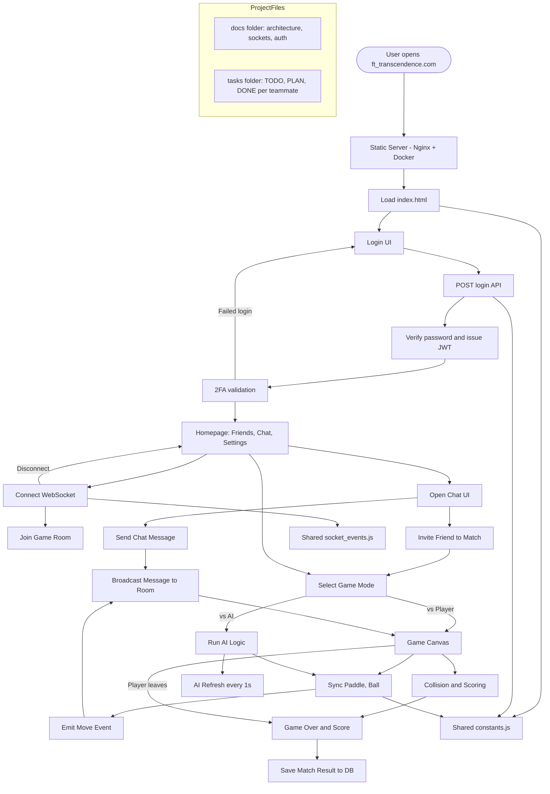

```mermaid
flowchart TD

  Start([User opens ft_transcendence.com]) --> NGINX[Static Server - Nginx + Docker]
  NGINX --> FE1[Load index.html]
  FE1 --> FE2[Login UI]
  FE2 --> BE1[POST login API]
  BE1 --> BE2[Verify password and issue JWT]
  BE2 --> BE3[2FA validation]
  BE3 --> FE4[Homepage: Friends, Chat, Settings]
  BE3 -->|Failed login| FE2

  FE4 --> WS1[Connect WebSocket]
  WS1 --> WS_JOIN[Join Game Room]
  FE4 --> ChatUI[Open Chat UI]
  ChatUI --> WS2[Send Chat Message]
  WS2 --> WS_BROADCAST[Broadcast Message to Room]

  ChatUI --> INVITE[Invite Friend to Match]
  INVITE --> GameChoice[Select Game Mode]
  FE4 --> GameChoice
  GameChoice -->|vs Player| FE6[Game Canvas]
  GameChoice -->|vs AI| AI_LOGIC[Run AI Logic]

  FE6 --> G1[Sync Paddle, Ball]
  G1 --> WS3[Emit Move Event]
  WS3 --> WS_BROADCAST
  WS_BROADCAST --> FE6
  FE6 --> G2[Collision and Scoring]
  G2 --> G3[Game Over and Score]
  G3 --> BE6[Save Match Result to DB]

  AI_LOGIC --> G1
  AI_LOGIC --> AI_REFRESH[AI Refresh every 1s]

  WS1 -->|Disconnect| FE4
  FE6 -->|Player leaves| G3

  FE1 --> SH1[Shared constants.js]
  BE1 --> SH1
  G1 --> SH1
  WS1 --> SH2[Shared socket_events.js]

  subgraph ProjectFiles
    Docs[docs folder: architecture, sockets, auth]
    Tasks[tasks folder: TODO, PLAN, DONE per teammate]
  end
```